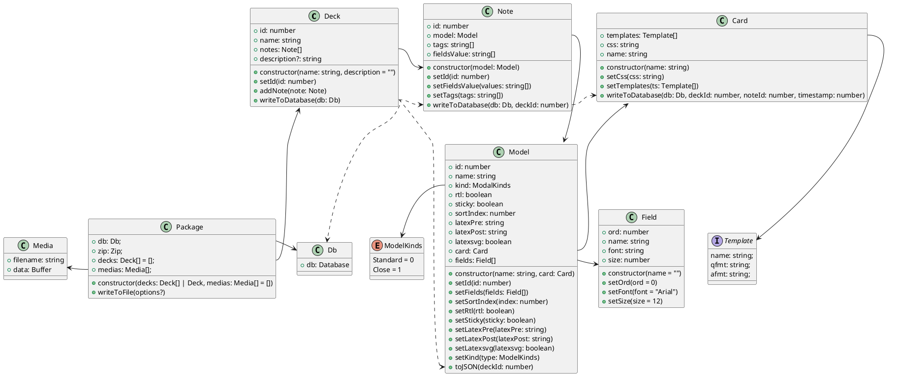

```plantuml
@startuml
class Deck {
    +id: number
    +name: string
    +notes: Note[]
    +description?: string
    +constructor(name: string, description = "")
    +setId(id: number)
    +addNote(note: Note)
    +writeToDatabase(db: Db)
}
Deck::writeToDatabase ..> Db

class Note {
    +id: number
    +model: Model
    +tags: string[]
    +fieldsValue: string[]
    +constructor(model: Model)
    +setId(id: number)
    +setFieldsValue(values: string[])
    +setTags(tags: string[])
    +writeToDatabase(db: Db, deckId: number)
}
Deck::writeToDatabase ..> Note::writeToDatabase
Deck::notes -> Note::constructor

class Model {
    +id: number
    +name: string
    +kind: ModalKinds
    +rtl: boolean
    +sticky: boolean
    +sortIndex: number
    +latexPre: string
    +latexPost: string
    +latexsvg: boolean
    +card: Card
    +fields: Field[]
    +constructor(name: string, card: Card)
    +setId(id: number)
    +setFields(fields: Field[])
    +setSortIndex(index: number)
    +setRtl(rtl: boolean)
    +setSticky(sticky: boolean)
    +setLatexPre(latexPre: string)
    +setLatexPost(latexPost: string)
    +setLatexsvg(latexsvg: boolean)
    +setKind(type: ModelKinds)
    +toJSON(deckId: number)
}
Deck::writeToDatabase ..> Model::toJSON
Note::model -> Model
Model::fields -> Field
Card <- Model::card

enum ModelKinds {
    Standard = 0
    Close = 1
}
ModelKinds <- Model::kind

class Field {
    +ord: number
    +name: string
    +font: string
    +size: number
    +constructor(name = "")
    +setOrd(ord = 0)
    +setFont(font = "Arial")
    +setSize(size = 12)
}
class Card {
    +templates: Template[]
    +css: string
    +name: string
    +constructor(name: string)
    +setCss(css: string)
    +setTemplates(ts: Template[])
    +writeToDatabase(db: Db, deckId: number, noteId: number, timestamp: number)
}
interface Template {
    name: string;
    qfmt: string;
    afmt: string;
}
Card::templates --> Template
Note::writeToDatabase .> Card::writeToDatabase

class Db {
    +db: Database
}
class Package {
    +db: Db;
    +zip: Zip;
    +decks: Deck[] = [];
    +medias: Media[];
    +constructor(decks: Deck[] | Deck, medias: Media[] = [])
    +writeToFile(options?)
}
Package::db -> Db
Package::decks -up-> Deck

class Media {
    +filename: string
    +data: Buffer
}
Package::medias -left-> Media
@enduml
```